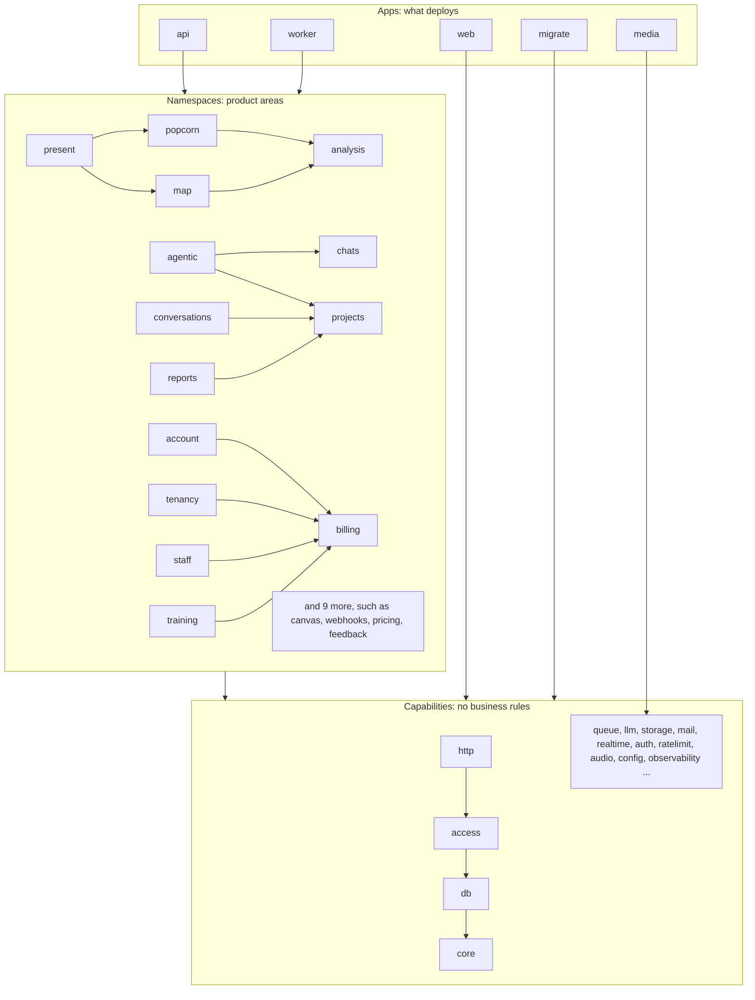

# echo platform

The Bun backend for echo: five programs that deploy, built from forty-two libraries.

## Run it locally

With docker, `bun run setup` starts Postgres from `compose.yml`, migrates and seeds, and `bun run dev` starts the API.

Without docker, run Postgres natively and start everything with [mprocs](https://github.com/pvolok/mprocs) from `dembrane/mprocs.yaml`.

You need bun (the version in `.bun-version`), pnpm, mprocs, ffmpeg on your `PATH` (with no `MEDIA_URL` the API and worker run it in-process), and Postgres 16 with pgvector on port 5432. [Postgres.app](https://postgresapp.com) ships pgvector.

One-time setup, from `dembrane/platform`:

1. Create the `echo` role and database. The role is a superuser, as it is in `compose.yml`, so migrations can create the `vector` extension.

   ```sh
   createuser --superuser echo
   psql postgres -c "alter role echo password 'echo'"
   createdb --owner=echo echo
   ```

2. Create `.env.local` from the example, on port 5432 instead of compose's 5433, with its own secrets:

   ```sh
   sed 's/:5433/:5432/' .env.example > .env.local
   echo "AUTH_SECRET=$(head -c 32 /dev/urandom | base64)" >> .env.local
   echo "INVITE_HASH_SECRET=$(head -c 32 /dev/urandom | base64)" >> .env.local
   ```

3. Install dependencies, migrate and seed:

   ```sh
   bun install
   bun run db:migrate && bun run seed:verification-topics
   (cd ../frontend && pnpm install)
   ```

Then run `mprocs` from `dembrane/`. It starts:

- **api** on http://localhost:8080, restarting on change
- **worker**, which does not restart on change; select it and press `r` to restart it
- **dashboard** on http://localhost:5173
- **portal** on http://localhost:5174

The dashboard and portal proxy `/api` to the API on 8080. **migrate** does not start on its own: select it and press `s` after pulling new migrations. Uploaded files go to `.data/files` on disk.

## Apps and packages

`apps/` holds the programs that deploy and run. Each has a `src/main.ts` that reads config, wires the packages together and starts.

- **api**: the HTTP server. Every namespace's routes are mounted in `apps/api/src/app.ts`.
- **worker**: runs queued jobs and schedules (the audio pipeline, analysis, reports, emails, billing timers).
- **media**: the ffmpeg service (below).
- **web**: serves the built dashboard and participant portal, and proxies `/api` to the API.
- **migrate**: runs before every rollout: schema migrations, the queue schema, database grants.

`packages/` holds libraries. A package never runs on its own; an app composes it.

## What media is, and why it is its own app

media is an ffmpeg service. It probes, converts, splits and merges audio and does nothing else: it has no database, no bucket credentials and no secrets, because callers hand it presigned URLs to read from and write to. It runs apart from the API and the worker because audio conversion is CPU-heavy native work. Cloud Run scales it from 0 to 10 instances, each running one conversion at a time, and a crash or an out-of-memory kills that one conversion, not the API or the worker. The worker's audio pipeline calls it over HTTP, and so does the API for an upload's duration and for merged audio downloads. The ffmpeg code itself lives in `packages/audio`; `apps/media` is only its HTTP shell. Locally, with no `MEDIA_URL`, the same code runs ffmpeg inside the calling process.

## The layers

Three layers, top to bottom. A dependency points down only.

1. **Apps** may import anything.
2. **Namespaces** are product areas: projects, conversations, chats, account, popcorn and so on. Each owns its routes, jobs, storage and business rules. A namespace imports capabilities. It imports another namespace only when its `package.json` lists that namespace under `dembrane.allow` with a reason; the list is at the end of this file and shows where the lines are still blurred.
3. **Capabilities** are building blocks with no business rules: config, db, core, auth, access, queue, storage, llm, mail and so on. A capability never imports a namespace or an app.

`bun run packages check` enforces this in CI (it is part of `bun run check`). Each package states its layer and a one-line description in its `package.json`; the list below is generated from those and from the imports.



The diagram draws the main arrows between namespaces; the full list of allowed ones is at the end of this file. Every namespace uses the capabilities.

## Where to start reading

- **Add a route.** Open a small namespace such as `packages/webhooks/src`: `routes.ts` returns a Hono router, its handlers call `service.ts`, which calls `storage.ts`. Check the caller with `projectFor` from `@dembrane/http`. The API mounts the router in `apps/api/src/app.ts`.
- **Add a background job.** Define it with `defineJob` in the namespace's `jobs.ts` (see `packages/webhooks/src/jobs.ts`). Add it to the list the API starts in `apps/api/src/main.ts` so it can be enqueued, and register its handler in `registrations` in `apps/worker/src/jobs.ts`. Services enqueue through a `JobSink` from `@dembrane/queue`.
- **Add a config key.** Declare it in `packages/config/src/schema.ts` with `key(ENV_NAME, schema, { description })`, override it per environment in `packages/config/environments/*.ts`, and read it as `config.<section>.<key>`. `bun run config check` fails when a key is declared but never read.

A new package needs `description` and `dembrane.layer` in its `package.json`; then run `bun run packages write` to refresh the list below.

## Packages

<!-- package-map:start (generated by `bun run packages write`; do not edit) -->

5 apps, 24 namespaces, 19 capabilities. "in" is how many packages import it, "out" how many it imports.
Most namespaces use core, db, observability, access, http, legacy-shape, queue; the lines below leave those out.

**Apps**

- **api** (in 0, out 40): The HTTP server: mounts every namespace's routes and answers the dashboard, the portal and outside agents. Uses 23 namespaces and 17 capabilities.
- **worker** (in 0, out 27): Runs queued jobs and schedules: the audio pipeline, analysis, reports, emails, billing timers. Uses 15 namespaces and 12 capabilities.
- **migrate** (in 0, out 8): The job that runs before every rollout: schema migrations, the queue schema, database grants, the default verification topics, and on PR previews the sample data. Uses accounts, verify, samples and 5 capabilities.
- **media** (in 0, out 3): The ffmpeg service: probes, converts, splits and merges audio, one job per instance. Uses observability, config, audio.
- **web** (in 0, out 2): Serves the built dashboard and participant portal and proxies /api to the API. Uses observability, config.

**Namespaces**

- **billing** (in 6, out 9): Plans, seats, Mollie payments, invoices and overage. Used by account, tenancy, staff, training and 2 more. Uses i18n, mail.
- **webhooks** (in 5, out 7): A project's outbound webhooks: settings, signed delivery, retries. Used by conversations, accounts, reports, api and 1 more. Uses only the common ones.
- **analysis** (in 5, out 10): The analysis engine: recipes, runs, snapshots and revisions that maps and popcorn build on. Used by popcorn, map, present, api and 1 more. Uses realtime, ratelimit, llm.
- **conversations** (in 5, out 16): Conversations, the participant portal, the audio pipeline, live monitoring and search. Used by agentic, verify, agent-access, api and 1 more. Uses projects, webhooks, prompts, transcription, audio and 4 more.
- **projects** (in 4, out 7): Projects, tags, goals, methodologies, prompt templates and the report request. Used by conversations, agentic, reports, api. Uses realtime.
- **notifications** (in 4, out 5): In-app notifications and announcements, and the Notifier other namespaces emit through. Used by account, agentic, reports, api. Uses only the common ones.
- **popcorn** (in 4, out 12): Popcorn: one live deck per project, refreshed on a tick, with demos and translations. Used by accounts, present, api, worker. Uses analysis, analytics, realtime, ratelimit, llm.
- **account** (in 3, out 14): The signed-in user's own account: profile, onboarding, settings, invites, transactional email. Used by accounts, api, worker. Uses notifications, billing, auth, i18n, mail and 3 more.
- **accounts** (in 3, out 14): Customer accounts as sales runs them: offers, contracts, signing, demos, reminders. Used by api, migrate, worker. Uses account, popcorn, webhooks, i18n, mail and 3 more.
- **map** (in 3, out 11): Argument maps: saved maps, the graph, generation, titles and fact-checks. Used by present, api, worker. Uses analysis, realtime, ratelimit, llm.
- **chats** (in 2, out 9): Chat with a project's conversations (the v1 chats and the chat BFF). Used by agentic, api. Uses analytics, ratelimit, llm.
- **agentic** (in 2, out 15): The assistant: agent runs, their event streams, memory, and its own canvas tools. Used by api, worker. Uses chats, notifications, projects, conversations, analytics and 3 more.
- **canvas** (in 2, out 10): Dynamic canvases: a live wall built from recent transcript, redrawn on a tick. Used by api, worker. Uses realtime, ratelimit, llm.
- **feedback** (in 2, out 9): Bug reports, feedback responses and the forward to support. Used by api, worker. Uses storage, ratelimit.
- **present** (in 2, out 11): Present: the published, audience-facing view of a popcorn deck and a map. Used by api, worker. Uses map, popcorn, analysis, realtime, ratelimit.
- **pricing** (in 2, out 8): The pricing configurator and the bookings it forwards. Used by api, worker. Uses storage, ratelimit.
- **reports** (in 2, out 11): Report generation and the report timeline. Used by api, worker. Uses notifications, projects, webhooks, llm.
- **tenancy** (in 2, out 11): Orgs and workspaces: members, settings, access requests, support access, project shares. Used by api, worker. Uses billing, i18n, mail, storage.
- **verify** (in 2, out 7): Verification topics and artifacts participants see in the portal. Used by api, migrate. Uses conversations, prompts.
- **agent-access** (in 1, out 10): Outside AI agents reaching dembrane: the MCP server, OAuth, and the tools it exposes. Used by api. Uses conversations, analytics, realtime, ratelimit.
- **samples** (in 1, out 3): Sample data every PR preview carries: the Millbrook (sample) workspace in the Acme Civic (sample) org, with generated conversations, a report and a chat. Used by migrate. Uses config, llm.
- **staff** (in 1, out 11): The staff console: support tools, billing rollups, privacy exports and erasure. Used by api. Uses billing, i18n, mail, storage.
- **stats** (in 1, out 4): Public usage numbers the website shows. Used by api. Uses ratelimit.
- **training** (in 1, out 8): Training as its own product: catalog, rosters, licences, staff provisioning. Used by api. Uses billing, mail.

**Capabilities**

- **core** (in 33, out 0): Errors, ids, the operation context and asset paths every package shares. Used by db, access, http, legacy-shape and 29 more. Uses nothing.
- **db** (in 32, out 1): The Drizzle schema for every table, migrations and the database connection. Used by access, queue, ratelimit, i18n and 28 more. Uses core.
- **observability** (in 29, out 0): Structured logging and tracing. Used by http, queue, realtime, analytics and 25 more. Uses nothing.
- **access** (in 25, out 2): Who may do what: roles, policies and tiers resolved for an org, workspace or project. Used by http, billing, webhooks, analysis and 21 more. Uses db, core.
- **http** (in 25, out 3): What every route shares: the signed-in caller, body validation, project and workspace guards. Used by legacy-shape, billing, webhooks, analysis and 21 more. Uses access, observability, core.
- **legacy-shape** (in 19, out 2): Response shapes and number and time formats the Python API and Directus produced, kept byte for byte. Used by billing, webhooks, analysis, conversations and 15 more. Uses http, core.
- **queue** (in 19, out 2): Durable background jobs and workflows on Postgres (DBOS): define, enqueue, run. Used by billing, webhooks, analysis, conversations and 15 more. Uses observability, db.
- **llm** (in 14, out 0): Language model and embedding calls on Vertex, with fallbacks and fakes for tests. Used by i18n, transcription, analysis, conversations and 10 more. Uses nothing.
- **ratelimit** (in 13, out 2): Rate limits counted in Postgres or memory. Used by analysis, conversations, popcorn, account and 9 more. Uses db, core.
- **realtime** (in 10, out 2): Live updates: Postgres LISTEN fanned out to server-sent event streams. Used by analysis, conversations, projects, popcorn and 6 more. Uses observability, core.
- **config** (in 10, out 0): Typed configuration per environment, and the `bun run config` checks. Used by i18n, account, accounts, agentic and 6 more. Uses nothing.
- **storage** (in 9, out 0): Object storage (S3 or local disk) and presigned uploads. Used by conversations, account, accounts, feedback and 5 more. Uses nothing.
- **mail** (in 8, out 0): Sending email (SendGrid, or memory in tests). Used by billing, account, accounts, tenancy and 4 more. Uses nothing.
- **i18n** (in 7, out 4): Server-rendered texts in the recipient's language, and the catalog translator. Used by billing, account, accounts, tenancy and 3 more. Uses config, llm, db, core.
- **analytics** (in 5, out 1): Product analytics capture (PostHog). Used by popcorn, chats, agentic, agent-access and 1 more. Uses observability.
- **audio** (in 4, out 0): ffmpeg and ffprobe wrappers, audio formats, and the client for the media app. Used by conversations, api, media, worker. Uses nothing.
- **prompts** (in 3, out 0): The Jinja prompt templates carried over from Python, rendered the same way. Used by transcription, conversations, verify. Uses nothing.
- **transcription** (in 3, out 3): Speech to text with Gemini, plus PII redaction and a fake for tests. Used by conversations, api, worker. Uses prompts, llm, observability.
- **auth** (in 3, out 2): Sign-in and sessions (Better Auth) and the identity sync from Directus. Used by account, api, migrate. Uses db, core.

**Allowed imports between namespaces**

- account uses billing: Accepting an invite or removing a member reconciles the org's paid seats.
- account uses notifications: Tells staff and admins about sign-ups and accepted invites.
- accounts uses account: Sends its emails through account's email job and templates.
- accounts uses popcorn: A prospect's demo is a seeded popcorn deck.
- accounts uses webhooks: Delivers account events with the webhook sender and its private-address guard.
- agent-access uses conversations: Agent tools read conversations through the conversation BFF's reads.
- agentic uses chats: Agent runs live inside chats and name them.
- agentic uses conversations: The live-status tool reads the host monitor over conversations' presence store.
- agentic uses notifications: Notifies the user when a run needs them or finishes.
- agentic uses projects: The assistant reads and edits project fields through projects' storage.
- conversations uses projects: The portal applies the project's legal basis and external-client rules.
- conversations uses webhooks: Conversation events fire the project's webhooks.
- map uses analysis: A map is an analysis run and snapshot; the engine lives in analysis.
- popcorn uses analysis: A deck is an analysis snapshot; popcorn's shared tick helpers still live in analysis.
- present uses analysis: Reads map snapshots and budgets from the analysis engine.
- present uses map: Shows a map's assessments and fact-checks to an audience.
- present uses popcorn: Shows a popcorn deck to an audience: its settings, bundle and pages.
- reports uses notifications: Notifies the requester when a report is ready.
- reports uses projects: Handles the report job that projects defines and enqueues.
- reports uses webhooks: A finished report fires the project's webhooks.
- staff uses billing: Staff rollups and support tools read and change billing state, and reuse its email frame.
- tenancy uses billing: Membership changes reconcile the org's paid seats.
- training uses billing: Licence changes notify org admins through billing's own Notifier.
- verify uses conversations: A portal feature: reuses conversations' participant token and dependencies.

<!-- package-map:end -->
